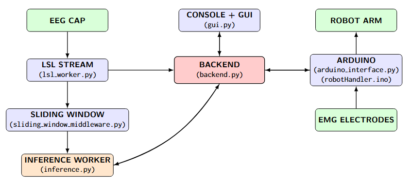
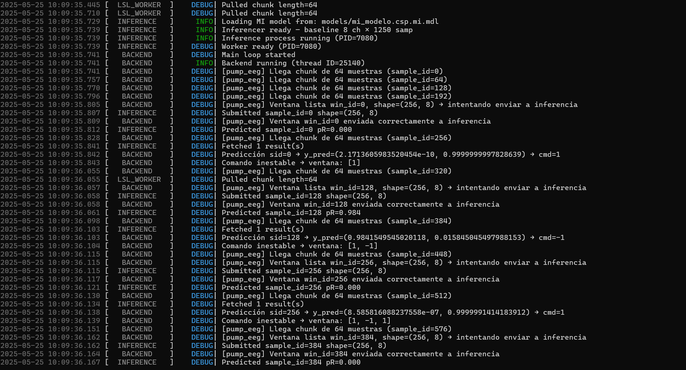

# EEG-EMG Neuroprosthetic Robotic Control System

Seamlessly control a robotic arm and gripper using real-time EEG and EMG signals. Developed for the MSc in Neurotechnology at Universidad Politécnica de Madrid, this project showcases assistive technology applications of biosignal processing and machine learning.

<p align="center">
  
</p>

## 🌟 About the Project

Combine brain and muscle signals to operate the **PhantomX AX-12 Reactor** robotic arm:

* **EEG → Direction**: Decode motor intention from EEG (8‑channel Bitbrain cap via LSL).
* **EMG → Gripper**: Process EMG on Arduino Uno and toggle the gripper in real time.
* **Arduino Firmware**: Includes `robotHandler.ino` and supporting interface for low‑level servo control.

All technical details, design rationales, and performance analysis are documented in **GR05-D3.pdf** (Deliverable D3).

## 🏗️ System Architecture

A modular architecture ensures smooth, real-time operation:

1. **EEG Acquisition**: LSL stream → background thread → sliding-window middleware.
2. **Inference Engine**: CSP+rLDA model in separate process → 100 Hz predictions.
3. **EMG Acquisition**: Arduino ISR at 1 kHz → envelope extraction → 200 Hz serial stream.
4. **Backend Controller**: Python coordinates data flow → sends commands to Arduino.
5. **GUI (PySide6)**: Live plotting of EEG, EMG, and prediction stability.

<p align="center">
  
  
</p>

## ⚡ Quick Start

### Prerequisites

* Windows (PowerShell), Python 3.10+, Arduino IDE
* Virtual environment (`.venv`) configured

### Installation & Setup

```powershell
git clone https://github.com/Mixnikon108/Neuroprosthetics.git
cd Neuroprosthetics
Set-ExecutionPolicy -Scope Process -ExecutionPolicy Bypass
.\.venv\Scripts\Activate.ps1
pip install -r requirements.txt
```

### Run Backend + GUI

```powershell
python -m src.project.backend --lsl <LSL_NAME> --port <COM_PORT> --gui
```

* `<LSL_NAME>`: Your EEG stream ID
* `<COM_PORT>`: Arduino serial port (e.g., COM3)

### Deploy Arduino Firmware

1. Open `robotHandler.ino` in Arduino IDE
2. Select **Arduino Uno** and correct COM port
3. Upload to board

## 📂 Project Contents

```
Neuroprosthetics/
├── .venv/
├── img/                # Architecture & GUI screenshots
├── models/             # Trained CSP+rLDA model
├── src/project/
│   ├── backend.py
│   ├── gui.py
│   ├── inference.py
│   ├── lsl_worker.py
│   ├── sliding_window_middleware.py
│   ├── arduino_interface.py
│   └── robotHandler.ino
├── config/config.yml
├── GR05-D3.pdf         # Full project report
├── requirements.txt
└── README.md           # ← This file
```

## 🚀 Future Work

* Adaptive EEG baseline updating
* Convolutional neural networks (e.g., EEGNet) for higher accuracy
* Hardware improvements: ARM-based MCU for non-blocking servo control

## 👤 Contact

**Jorge de la Rosa Padrón** – [@mixnikon](https://twitter.com/mixnikon)

Project: [github.com/yourusername/Neuroprosthetics](https://github.com/yourusername/Neuroprosthetics)

